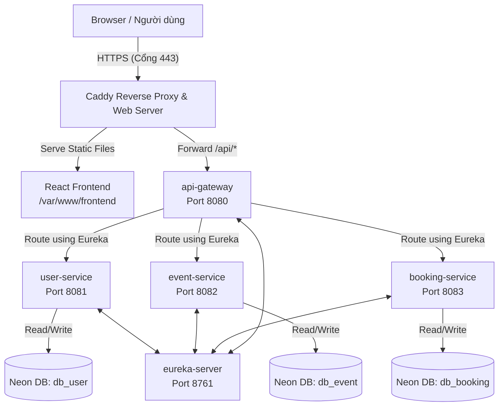

# 🚀 HƯỚNG DẪN DEPLOY DỰ ÁN EVENTPASS LÊN PRODUCTION

Tài liệu này hướng dẫn chi tiết từng bước để triển khai và cập nhật hệ thống **EventPass (Ticket Booking SOA)** trên môi trường thực tế (Production) sử dụng Tên miền riêng và chứng chỉ bảo mật SSL (HTTPS).

## 🗺️ Sơ đồ Luồng Hoạt Động trên Production



---

## 🛠️ CÁC BƯỚC THIẾT LẬP HẠ TẦNG BAN ĐẦU

### Bước 1: Trỏ DNS Tên miền
Truy cập trình quản trị DNS của tên miền (ví dụ Tenten) và cấu hình 2 bản ghi loại A:

| Loại | Tên (Host) | Giá trị (Value) | Giải thích |
| :--- | :--- | :--- | :--- |
| **A** | `@` | `103.166.185.111` | Trỏ tên miền chính (`eventpass.io.vn`) về VPS |
| **A** | `api` | `103.166.185.111` | Trỏ tên miền phụ (`api.eventpass.io.vn`) về VPS |

---

### Bước 2: Cấu hình Môi trường trên VPS (Ubuntu 22.04 LTS)
SSH vào VPS: `ssh root@103.166.185.111` và cài đặt các công cụ:
```bash
# 1. Cập nhật hệ thống
sudo apt update && sudo apt upgrade -y

# 2. Cài đặt Docker & Docker Compose
sudo apt install docker.io docker-compose -y

# 3. Cài đặt Caddy (Tự động cấp SSL/HTTPS miễn phí)
sudo apt install -y debian-keyring debian-archive-keyring apt-transport-https
curl -1sLf 'https://dl.cloudsmith.io/public/caddy/stable/gpg.key' | sudo gpg --dearmor -o /usr/share/keyrings/caddy-stable-archive-keyring.gpg
curl -1sLf 'https://dl.cloudsmith.io/public/caddy/stable/debian.deb.txt' | sudo tee /etc/apt/sources.list.d/caddy-stable.list
sudo apt update && sudo apt install caddy -y
```

---

### Bước 3: Cấu hình Caddy làm Web Server & Proxy
1. Mở file cấu hình Caddy: `nano /etc/caddy/Caddyfile`
2. Dán nội dung sau vào và lưu lại:
   ```caddy
   eventpass.io.vn {
       # 1. Chuyển tiếp API về Gateway
       handle /api/* {
           reverse_proxy localhost:8080
       }

       # 2. Phục vụ file tĩnh Frontend
       handle {
           root * /var/www/frontend
           file_server
           try_files {path} /index.html
       }
   }
   ```
3. Restart Caddy để tự động kích hoạt HTTPS:
   ```bash
   sudo systemctl restart caddy
   ```

---

## 🔄 HƯỚNG DẪN CẬP NHẬT CODE MỚI & REDEPLOY (QUAN TRỌNG)

Khi bạn thực hiện thay đổi code ở local và muốn cập nhật lên VPS, hãy làm theo các bước dưới đây:

### 1. Cập nhật Frontend (React + Vite)
Mỗi khi có thay đổi code giao diện ở thư mục `frontend`:

* **Bước 1: Biên dịch code ở máy local (Windows)**
  Mở CMD/PowerShell tại thư mục `frontend` của dự án và chạy:
  ```powershell
  # Đảm bảo file .env.production chứa dòng: VITE_API_BASE_URL=/
  npm run build
  ```
  Lệnh này sẽ tạo ra thư mục `frontend/dist` mới.

* **Bước 2: Upload file tĩnh lên VPS**
  Chạy lệnh sau tại thư mục `frontend` của máy local để đồng bộ file lên VPS qua SCP:
  ```powershell
  # Xóa các file cũ trên VPS và tải file mới lên
  ssh root@103.166.185.111 "rm -rf /var/www/frontend/*"
  scp -r dist/* root@103.166.185.111:/var/www/frontend/
  ```

* **Bước 3: Phân quyền thư mục trên VPS**
  ```powershell
  ssh root@103.166.185.111 "chmod -R 755 /var/www/frontend"
  ```
  *Giao diện mới sẽ hiển thị ngay lập tức khi người dùng F5 lại trang.*

---

### 2. Cập nhật Backend (Spring Boot Microservices)
Mỗi khi có thay đổi logic Java ở các service backend:

* **Bước 1: Nén mã nguồn backend tại local (Windows)**
  Mở CMD/PowerShell tại thư mục gốc của dự án và chạy lệnh:
  ```powershell
  # Nén các thư mục backend (bỏ qua frontend và git)
  tar -czf backend.tar.gz eureka-server api-gateway user-service event-service booking-service docker-compose.prod.yml
  ```

* **Bước 2: Upload file nén lên VPS**
  Chạy lệnh tại local:
  ```powershell
  scp backend.tar.gz root@103.166.185.111:/app/
  ```

* **Bước 3: Giải nén mã nguồn trên VPS**
  Chạy lệnh tại local:
  ```powershell
  ssh root@103.166.185.111 "tar -xzf /app/backend.tar.gz -C /app; rm /app/backend.tar.gz"
  ```

* **Bước 4: Rebuild và khởi động lại các Container**
  Chạy lệnh tại local để yêu cầu Docker trên VPS build lại mã nguồn Java mới và chạy:
  ```powershell
  ssh root@103.166.185.111 "cd /app; docker-compose -f docker-compose.prod.yml up -d --build"
  ```
  *Docker sẽ tự động phát hiện code Java thay đổi, chạy Maven đóng gói lại thành file .jar mới và khởi chạy lại các container tương ứng.*

---

## 🔒 AN TOÀN & BẢO MẬT TRÊN PRODUCTION

1. **Hibernate DDL-Auto:**
   Đảm bảo cấu hình DDL-auto trong file `.env` trên VPS luôn để là `validate` hoặc `none` để tránh việc Hibernate tự động cấu trúc lại bảng gây mất mát dữ liệu:
   ```ini
   SPRING_JPA_HIBERNATE_DDL_AUTO=validate
   ```
2. **Quản lý tường lửa (UFW):**
   Chỉ mở các cổng cần thiết ra bên ngoài:
   ```bash
   sudo ufw status
   # Đảm bảo chỉ cho phép: 22 (SSH), 80 (HTTP), 443 (HTTPS), và 8761 (Eureka Dashboard - nếu cần demo)
   ```
